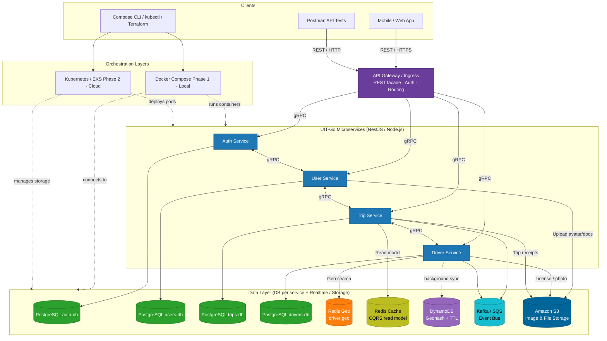

# UIT-Go – System Architecture 

> **UIT-Go** is a ride-hailing backend platform built with a microservices architecture.  
> The system is designed to run locally with **Docker Compose (Phase 1)** and to be deployable to the cloud with **Kubernetes/EKS (Phase 2)**.  
> External clients communicate via **REST / HTTPS**, while internal services communicate using **gRPC**.

---

## 1. Goals and Scope

- Build an independent, modular backend where each **service owns its own database** (Database-per-Service pattern).  
- Support core workflows:
  - Authentication and authorization  
  - User profile and driver management  
  - Trip creation, status transitions, and fare calculation  
  - Real-time driver location updates and proximity search  
  - File and image storage (avatars, licenses, receipts)
- **Phase 1**: fully functional on local Docker Compose, verified by Postman collections and unit tests.  
- **Phase 2**: extend to Kubernetes, gRPC-only internal network, Redis Cluster + DynamoDB for scalability, CQRS read models, Kafka/SQS event bus, and S3 storage.

---

## 2. System Overview

| Layer | Components | Technologies |
|-------|-------------|---------------|
| **Clients** | Mobile/Web App, Postman API Tests, DevOps tools (Compose CLI, kubectl, Terraform) | HTTPS / REST |
| **Gateway & Ingress** | API Gateway / Ingress (REST facade, auth, routing) | Nginx / Express Gateway |
| **Orchestration** | Docker Compose (local) → Kubernetes/EKS (cloud) | Docker, K8s, Terraform (IaC) |
| **Services** | Auth, User, Trip, Driver | NestJS / Node.js, gRPC |
| **Data Layer** | PostgreSQL × 4, Redis Geo, Redis Cache (CQRS), DynamoDB, Kafka/SQS, S3 | PostgreSQL, Redis, AWS DynamoDB, Kafka/SQS, Amazon S3 |

---

## 3. Architecture Diagram

## 4. Service Descriptions

### 4.1 Auth Service
Handles user authentication and authorization:
- Registration, login, logout
- JWT issuance and refresh tokens
- Role and permission validation (for drivers, passengers, admins)

**Database:** `auth-db` (PostgreSQL)  
**Responsibilities:**
- Stores credentials, access/refresh tokens, and user sessions
- Provides `validateToken()` and `authorizeRequest()` RPC methods  
**Why PostgreSQL:** ensures ACID integrity for credential management.

---

### 4.2 User Service
Handles all user and driver profile data.
- Profile information, linked documents, and verification states
- Integration with **S3** for file uploads (avatars, ID photos, license scans)

**Database:** `users-db` (PostgreSQL)  
**Responsibilities:**
- Exposes CRUD APIs via gRPC to other services
- Communicates with **Auth Service** for token validation
- Uploads files to **S3** via signed URLs

---

### 4.3 Trip Service
Central to ride management and trip lifecycle.
- Creates new trips, manages workflow state transitions:
  `REQUESTED → DRIVER_ASSIGNED → ARRIVED → IN_TRIP → COMPLETED/CANCELED`
- Fetches nearby drivers from **Driver Service** via gRPC  
- Publishes trip events for monitoring or analytics

**Database:** `trips-db` (PostgreSQL)  
**Responsibilities:**
- Trip creation and cancellation
- Status change via state machine validation
- Event publishing to **Kafka/SQS**
- Maintains a **CQRS read model** in **Redis Cache**

---

### 4.4 Driver Service
Responsible for driver availability, location tracking, and proximity search.

**Database:** `drivers-db` (PostgreSQL)  
**Realtime data:**
- **Redis Geo** → hot storage for active drivers
- **DynamoDB Geohash + TTL** → scalable, cost-effective location persistence (background sync)

**Responsibilities:**
- Accepts periodic GPS updates from drivers
- Uses `GEOADD` / `GEOSEARCH` for real-time search
- Filters inactive drivers via TTL expiration
- Synchronizes location snapshots to DynamoDB for analytics

---

## 5. Communication Patterns

| Communication | Protocol | Usage |
|----------------|-----------|--------|
| **Client ↔ Gateway** | REST / HTTPS | External API entry point |
| **Gateway ↔ Services** | gRPC | Internal gateway-to-service RPC calls |
| **Service ↔ Service** | gRPC | Cross-service communication (Auth ↔ User ↔ Trip ↔ Driver) |
| **Service ↔ Data Stores** | Native drivers | PostgreSQL, Redis, DynamoDB, Kafka/SQS, S3 |

**Pattern summary:**  
> *“REST at the edge, gRPC inside.”*  
Clients always use REST/HTTPs through the API Gateway; the gateway translates requests into gRPC for internal services to ensure high performance and strict type contracts.

---

## 6. Deployment Topology

### 6.1 Docker Compose (Phase 1)
Used for local development and functional testing.  
Each microservice and its database runs as a separate container:
- Network: `uitgo-net`
- Shared `.env` for connection strings
- Includes Redis, Kafka, and S3 mock (MinIO) containers
- Perfect for Postman verification and CI testing

### 6.2 Kubernetes / EKS (Phase 2)
Future deployment for cloud scalability:
- Each service → Kubernetes **Deployment**  
- Each database → external managed service (RDS / Elasticache / DynamoDB / S3)
- Uses **Ingress Controller** for API Gateway
- Includes **ConfigMap** and **Secret** management
- Supports autoscaling and rolling updates via HPA

---

## 7. Data Management

| Storage | Purpose | Description | Phase |
|----------|----------|-------------|--------|
| **PostgreSQL** | Primary databases | Stores relational data per service | 1 |
| **Redis Geo** | Realtime location | Keeps active driver coordinates | 1 |
| **Redis Cache (CQRS)** | Read model | Fast reads for trip summary | 2 |
| **DynamoDB (Geohash + TTL)** | Long-term location store | Scalable geo-index storage | 2 |
| **Kafka / SQS** | Event Bus | Publishes trip and driver updates | 2 |
| **Amazon S3** | File storage | Stores images, receipts, and documents | 1 |

**CQRS pattern:**  
Write operations update the PostgreSQL DB, while read queries are served from a lightweight Redis cache for fast responses.

---

## 8. Testing & Validation

### 8.1 Postman API Testing
- `UIT-Go.postman_collection.json` verifies:
  - Auth → register/login/token validation  
  - User → profile CRUD and file upload  
  - Trip → create/cancel/complete  
  - Driver → location update and proximity search  

### 8.2 Unit Tests
- **Framework:** Jest  
- **Auth Service:** password hashing, token issue/verify  
- **Trip Service:** valid state transitions, idempotent create  
- **Driver Service:** location precision, radius filtering, TTL expiration  

### 8.3 Integration Tests
- `docker-compose up` runs full stack
- Test flow:  
  1. Register & login user  
  2. Register driver + set online  
  3. Create trip → assign driver → complete trip  
- Validates gRPC + database consistency.

---

## 9. Orchestration & Infrastructure

| Environment | Tool | Description |
|--------------|------|-------------|
| **Local (Phase 1)** | Docker Compose | Runs all containers locally |
| **Cloud (Phase 2)** | Kubernetes (EKS) | Manages pods, networking, and autoscaling |
| **IaC** | Terraform | Provisions VPC, RDS, DynamoDB, S3, and Redis |
| **CI/CD** | GitHub Actions / Jenkins | Automates build and test pipeline |

**Compose (Phase 1)** is ideal for single-node demo or developer machines.  
**Kubernetes (Phase 2)** allows production-grade deployment with observability and high availability.

---

## 10. Summary

UIT-Go implements a **modern microservice architecture**:
- **Docker Compose (Phase 1):** local orchestration, simple REST-to-gRPC bridge.
- **Kubernetes (Phase 2):** scalable, observable, and cloud-native deployment.
- **REST for external clients**, **gRPC for internal service calls**.
- **DB-per-service pattern** ensures modularity and isolation.
- **Redis Geo + DynamoDB Geohash** guarantee real-time and scalable driver tracking.
- **Kafka/SQS event bus** enables asynchronous processing and system extensibility.
- **S3 storage** keeps file management decoupled and reliable.

> ✅ The architecture is production-oriented, cleanly layered, and ready for both academic evaluation and future deployment on AWS EKS.
