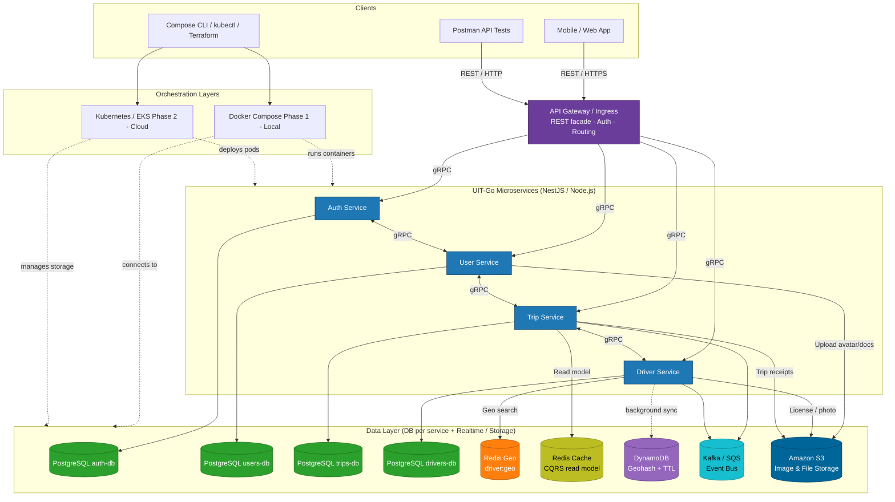

# UIT-Go – Kiến trúc Hệ thống

> **UIT-Go** là nền tảng đặt xe (ride-hailing) được xây dựng theo kiến trúc **microservices**.  
> Hệ thống có thể chạy **cục bộ bằng Docker Compose (Giai đoạn 1)** và **triển khai trên đám mây bằng Kubernetes/EKS (Giai đoạn 2)**.  
> Các client bên ngoài giao tiếp thông qua **REST / HTTPS**, còn các dịch vụ nội bộ sử dụng **gRPC** để truyền thông hiệu năng cao.

---

## 1. Mục tiêu và Phạm vi

- Xây dựng backend độc lập, module hóa, trong đó **mỗi service sở hữu cơ sở dữ liệu riêng** (mô hình Database-per-Service).  
- Hỗ trợ các quy trình nghiệp vụ cốt lõi:
  - Xác thực và phân quyền người dùng  
  - Quản lý hồ sơ người dùng và tài xế  
  - Tạo chuyến đi, thay đổi trạng thái và tính giá cước  
  - Cập nhật vị trí tài xế theo thời gian thực và tìm kiếm lân cận  
  - Lưu trữ hình ảnh và tài liệu (ảnh đại diện, giấy phép, biên lai)
- **Giai đoạn 1:** triển khai đầy đủ bằng Docker Compose, kiểm thử qua Postman và unit test.  
- **Giai đoạn 2:** mở rộng lên Kubernetes, chuyển toàn bộ giao tiếp nội bộ sang gRPC, hỗ trợ Redis Cluster + DynamoDB để mở rộng quy mô, CQRS read models, Kafka/SQS event bus, và lưu trữ trên S3.

---

## 2. Tổng quan Hệ thống

| Lớp | Thành phần | Công nghệ |
|------|-------------|------------|
| **Clients** | Ứng dụng Mobile/Web, Postman API Tests, công cụ DevOps (Compose CLI, kubectl, Terraform) | HTTPS / REST |
| **Gateway & Ingress** | API Gateway / Ingress (REST facade, xác thực, định tuyến) | Nginx / Express Gateway |
| **Orchestration** | Docker Compose (local) → Kubernetes/EKS (cloud) | Docker, K8s, Terraform (IaC) |
| **Services** | Auth, User, Trip, Driver | NestJS / Node.js, gRPC |
| **Tầng dữ liệu** | PostgreSQL × 4, Redis Geo, Redis Cache (CQRS), DynamoDB, Kafka/SQS, S3 | PostgreSQL, Redis, AWS DynamoDB, Kafka/SQS, Amazon S3 |

---

## 3. Sơ đồ Kiến trúc


---

## 4. Mô tả các Dịch vụ

### 4.1 Auth Service
Xử lý xác thực và phân quyền người dùng:

- Đăng ký, đăng nhập, đăng xuất  
- Cấp phát và làm mới **JWT**  
- Kiểm tra vai trò và quyền hạn (driver, passenger, admin)

**CSDL:** `auth-db` (PostgreSQL)  
**Chức năng:**
- Lưu thông tin đăng nhập, token và session  
- Cung cấp RPC `validateToken()` và `authorizeRequest()`  
- Đảm bảo tính toàn vẹn dữ liệu bằng **ACID**

---

### 4.2 User Service
Quản lý dữ liệu hồ sơ người dùng và tài xế:

- Lưu thông tin hồ sơ, trạng thái xác minh  
- Upload file lên **S3** (ảnh đại diện, giấy phép, CMND)

**CSDL:** `users-db` (PostgreSQL)  
**Chức năng:**
- Thực hiện **CRUD** hồ sơ qua gRPC  
- Liên kết với **Auth Service** để xác thực token  
- Quản lý tệp qua **URL có chữ ký (Signed URL)**

---

### 4.3 Trip Service
Quản lý toàn bộ vòng đời chuyến đi:

- Tạo chuyến, thay đổi trạng thái:  
  `REQUESTED → DRIVER_ASSIGNED → ARRIVED → IN_TRIP → COMPLETED / CANCELED`  
- Lấy tài xế gần nhất từ **Driver Service**  
- Phát sự kiện chuyến đi lên **Kafka/SQS**

**CSDL:** `trips-db` (PostgreSQL)  
**Chức năng:**
- Tạo, hủy và cập nhật trạng thái chuyến  
- Quản lý **CQRS read model** trong Redis Cache  

---

### 4.4 Driver Service
Quản lý tài xế, trạng thái và vị trí:

- **Redis Geo:** lưu vị trí hoạt động thời gian thực  
- **DynamoDB Geohash + TTL:** đồng bộ dữ liệu dài hạn và phân tích  

**CSDL:** `drivers-db` (PostgreSQL)  
**Chức năng:**
- Nhận cập nhật GPS định kỳ  
- Sử dụng `GEOADD` và `GEOSEARCH` để tìm kiếm theo bán kính  
- Đồng bộ dữ liệu nền sang **DynamoDB**  

---

## 5. Mô hình Giao tiếp

| Loại giao tiếp | Giao thức | Mục đích |
|-----------------|------------|-----------|
| **Client ↔ Gateway** | REST / HTTPS | Giao tiếp bên ngoài |
| **Gateway ↔ Services** | gRPC | Gọi RPC nội bộ |
| **Service ↔ Service** | gRPC | Giao tiếp giữa các dịch vụ |
| **Service ↔ Data Stores** | Native drivers | PostgreSQL, Redis, DynamoDB, Kafka/SQS, S3 |

> **Nguyên tắc:** “REST ở rìa, gRPC ở lõi.”  
> Mọi client đều giao tiếp qua **API Gateway** bằng REST, Gateway sau đó gọi các service nội bộ qua **gRPC** để đảm bảo hiệu năng và kiểm soát type an toàn.

---

## 6. Triển khai và Điều phối

### 6.1 Docker Compose (Giai đoạn 1)
- Môi trường **local** cho phát triển và kiểm thử.  
- Mỗi service và database chạy trong container riêng biệt.  
- Dùng mạng `uitgo-net`, chia sẻ file cấu hình `.env`.  
- Bao gồm các thành phần hỗ trợ: **Redis**, **Kafka**, **MinIO (S3 giả lập)**.  
- Phù hợp cho quá trình **Postman testing** và **CI pipeline**.

---

### 6.2 Kubernetes / EKS (Giai đoạn 2)
- Triển khai môi trường **production trên AWS EKS**.  
- Mỗi service được quản lý bằng **Deployment** riêng.  
- Database sử dụng dịch vụ quản lý: **RDS**, **ElastiCache**, **DynamoDB**, **S3**.  
- Dùng **Ingress Controller**, **ConfigMap**, **Secret**, và **HPA (Horizontal Pod Autoscaler)**.  
- Hỗ trợ **tự động mở rộng**, **rolling update** và **quan sát (observability)** thông qua stack Prometheus/Grafana.

---

## 7. Quản lý Dữ liệu

| Loại lưu trữ | Mục đích | Mô tả | Giai đoạn |
|---------------|-----------|--------|------------|
| **PostgreSQL** | Dữ liệu chính | Một DB riêng cho từng service | 1 |
| **Redis Geo** | Vị trí thời gian thực | Lưu vị trí tài xế đang online | 1 |
| **Redis Cache (CQRS)** | Mô hình đọc nhanh | Dữ liệu tóm tắt chuyến đi | 2 |
| **DynamoDB (Geohash + TTL)** | Lưu trữ lâu dài | Giảm chi phí, mở rộng dễ dàng | 2 |
| **Kafka / SQS** | Bus sự kiện | Phát và nhận sự kiện bất đồng bộ | 2 |
| **Amazon S3** | Lưu trữ file | Ảnh, hóa đơn, tài liệu | 1 |

> **CQRS pattern:**  
> Ghi dữ liệu vào **PostgreSQL**, trong khi các truy vấn đọc được phục vụ từ **Redis Cache** để tăng tốc phản hồi.

---

## 8. Kiểm thử và Xác thực

### 8.1 Kiểm thử Postman
Kiểm tra các API chính:

- **Auth:** đăng ký, đăng nhập, xác thực token  
- **User:** CRUD hồ sơ, upload ảnh  
- **Trip:** tạo / hủy / hoàn tất chuyến  
- **Driver:** cập nhật vị trí, tìm kiếm gần

---

### 8.2 Unit Test
- **Framework:** Jest  
- **Auth:** mã hóa mật khẩu, xác thực token  
- **Trip:** kiểm tra trạng thái hợp lệ  
- **Driver:** TTL, tìm kiếm theo bán kính  

---

### 8.3 Integration Test
- Dùng `docker-compose up` để khởi động toàn bộ hệ thống.  
- Quy trình kiểm thử tích hợp:
  1. Đăng ký & đăng nhập người dùng  
  2. Đăng ký tài xế & bật trạng thái online  
  3. Tạo chuyến → gán tài xế → hoàn tất  

---

## 9. Orchestration & Hạ tầng

| Môi trường | Công cụ | Mô tả |
|-------------|----------|--------|
| **Local (Phase 1)** | Docker Compose | Chạy toàn bộ container nội bộ |
| **Cloud (Phase 2)** | Kubernetes (EKS) | Quản lý pods, mạng, autoscale |
| **IaC** | Terraform | Khởi tạo VPC, RDS, DynamoDB, S3, Redis |
| **CI/CD** | GitHub Actions / Jenkins | Tự động build, test và deploy |

---

## 10. Tổng kết

UIT-Go thể hiện kiến trúc **microservice hiện đại**, linh hoạt và mở rộng:

- **Compose (Giai đoạn 1):** orchestration đơn giản, cầu nối REST → gRPC.  
- **Kubernetes (Giai đoạn 2):** cloud-native, có khả năng mở rộng và giám sát.  
- **REST** dành cho client, **gRPC** dành cho nội bộ.  
- **DB-per-service** đảm bảo tách biệt dữ liệu.  
- **Redis Geo + DynamoDB** hỗ trợ định vị thời gian thực.  
- **Kafka/SQS** phục vụ xử lý sự kiện bất đồng bộ.  
- **S3** cung cấp lưu trữ tệp tin cậy và tách biệt.

---

## 11. Hợp đồng API (Contracts)

### 11.1 Đặc tả API

#### REST (bên ngoài)
- Phiên bản hóa: `/api/v1/...`  
- Định nghĩa bằng **OpenAPI v3 / Swagger**  
- Xác thực: Bearer JWT  
- Phân trang: `page`, `limit`, `nextCursor`  
- Mẫu phản hồi lỗi:
  ```json
  {
    "code": "TRIP_NOT_FOUND",
    "message": "Không tìm thấy chuyến đi",
    "traceId": "abc123"
  }
  ```
#### gRPC (nội bộ)
- Định nghĩa trong các file `.proto`
- Phiên bản qua package: `uitgo.v1.auth`
- Đảm bảo tương thích ngược và kiểm tra kiểu dữ liệu chặt chẽ.

### 11.2 Nguyên tắc

- Giữ tương thích ngược khi mở rộng API.
- Hỗ trợ Idempotency-Key cho các thao tác POST.
- Xác thực schema & DTO trong mỗi request.
- Tự động sinh tài liệu: Swagger (REST) và ProtoDocs (gRPC).

### 11.3 Ví dụ
```
// trip.proto
service TripService {
  rpc CreateTrip(CreateTripRequest) returns (TripResponse);
  rpc UpdateTripStatus(UpdateTripStatusRequest) returns (TripResponse);
}

message CreateTripRequest {
  string userId = 1;
  string origin = 2;
  string destination = 3;
}
```

---

## 12. Vận hành và Runbook

### 12.1 Thứ tự khởi động
1. **Database & dịch vụ dữ liệu:** PostgreSQL, Redis, Kafka/MinIO  
2. **Core Services:** Auth, User, Driver, Trip  
3. **API Gateway**  
4. **Stack giám sát:** Prometheus, Grafana  

### 12.2 Healthcheck
- **REST:** `/healthz`, `/readyz` trả về  
  ```json
  { "status": "ok" }
- gRPC: sử dụng grpc.health.v1.Health
- Kubernetes: tự động restart các pod lỗi thông qua liveness và readiness probe.

## 12.3 Triển khai & Phát hành

#### Local
```bash
docker-compose up -d
```

#### Kubernetes
```bash
helm upgrade --install uitgo ./charts/uitgo
```

#### Chiến lược phát hành
- **Blue/Green** hoặc **Canary rollout:** triển khai theo tỉ lệ 10% → 50% → 100%.  
- **Rollback:**
  ```bash
  helm rollback
  ```
- **CI/CD:**  
  - Sử dụng **GitHub Actions** để build, kiểm thử và triển khai tự động trước khi merge vào nhánh chính.  
  - Đảm bảo các pipeline bao gồm:
    - **Unit Test**
    - **Integration Test**
    - **Security Scan**
  - Tự động dừng deploy nếu phát hiện lỗi test hoặc vi phạm quy tắc bảo mật.

---

### 12.4 Xử lý sự cố

1. Theo dõi **log**:
   ```bash
   kubectl logs <pod-name>
   ```
   Hoặc sử dụng hệ thống **Loki** để tập trung log theo namespace/service.  

2. Kiểm tra **Grafana Dashboard** để theo dõi:
   - CPU Usage  
   - Request Latency  
   - Error Rate  
   - Memory & Pod Restarts  

3. Nếu phát hiện sự cố nghiêm trọng:
   - Thực hiện **scale down** dịch vụ lỗi:
     ```bash
     kubectl scale deployment <service-name> --replicas=0
     ```
   - Hoặc **rollback** về phiên bản ổn định trước:
     ```bash
     helm rollback <release-name>
     ```

4. Gửi thông báo cho nhóm vận hành qua **Slack webhook** hoặc hệ thống cảnh báo tự động (**Alertmanager** / **PagerDuty**).  

> ⚠️ **Lưu ý:** Ghi nhận lại nguyên nhân và thời điểm xảy ra sự cố để phục vụ đánh giá sau vận hành (post-mortem).

---

### 12.5 Backup & Khôi phục

#### PostgreSQL
- Tạo **snapshot RDS hàng ngày**.  
- Bật **PITR (Point-In-Time Recovery)** để khôi phục dữ liệu theo mốc thời gian cụ thể.  
- Thực hiện lệnh restore:
  ```bash
  aws rds restore-db-instance-to-point-in-time     --source-db-instance-identifier uitgo-prod     --target-db-instance-identifier uitgo-restore     --use-latest-restorable-time
  ```

#### S3
- Bật **versioning** để lưu nhiều phiên bản của file.  
- Kích hoạt **lifecycle policy** để tự động lưu trữ hoặc xóa dữ liệu cũ.

#### Redis
- Lưu snapshot định kỳ bằng lệnh:
  ```bash
  SAVE
  ```
- Phục hồi snapshot nhanh khi container hoặc pod khởi động lại:
  ```bash
  redis-server --dir /data/ --dbfilename dump.rdb
  ```

---

> 💡 **Ghi chú:**  
> Các quy trình backup và khôi phục trên giúp đảm bảo hệ thống **UIT-Go** luôn duy trì được **khả năng phục hồi (resilience)** và **tính sẵn sàng (availability)** trong môi trường production.
